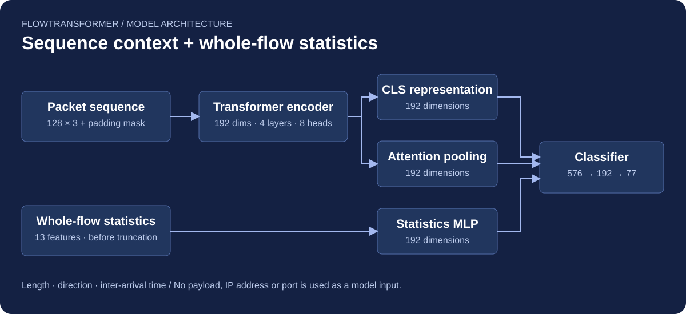
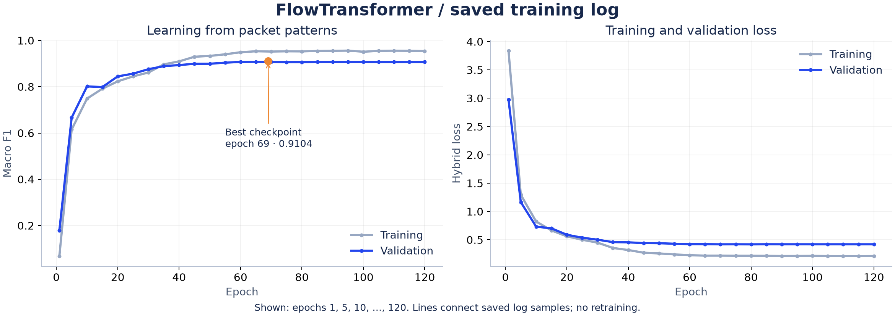
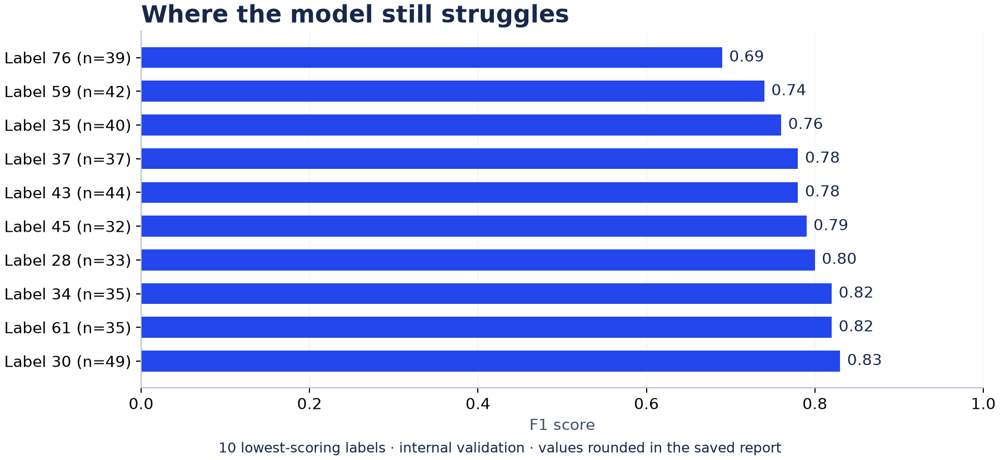

<div align="center">

# FlowTransformer
### Network traffic classification from packet metadata

**77 labels · 3 input channels · 13 statistical features**

[Model & code](pcap-flow-transformer/notebooks/train_flow_transformer.ipynb) · [Evaluation notes](docs/EVALUATION.md) · [한국어 소개](docs/README.ko.md)



</div>

## What this project does

FlowTransformer classifies network flows into application/service labels using **packet length, direction and inter-arrival time**. It combines a Transformer representation of the first 128 packets with statistics computed from the whole flow. Payload content, IP addresses and port numbers are not model inputs.

This is a **three-person university network-security project**. My contribution was model construction with AI coding tools, repeated training, hyperparameter tuning, experiment comparison and performance analysis. Raw PCAP collection and initial feature extraction were outside my individual scope.

## Results at a glance

| Internal validation metric | Saved result |
| --- | ---: |
| Macro F1 | **0.910384** |
| Micro F1 | 0.909805 |
| Weighted F1 | 0.909333 |
| Best checkpoint | Epoch **69** of 120 |
| Training / validation flows | 26,337 / 2,927 |
| Labels in the supplied training data | **77** |

These are **saved notebook results**, not a fresh reproduction or an independent test score. The validation set was also used to select the best checkpoint. The separate unlabeled inference file contains 229 retained flows; its predictions do not establish test accuracy.



The chart uses the log entries actually saved in the notebook: epoch 1 and every fifth epoch. The epoch-69 marker comes from the notebook's saved best-epoch output. It does not invent missing per-epoch values.

## Data → features → prediction

1. **Filter flows:** retain `num_packets > 10`.
2. **Construct three channels:** signed `log1p` packet length, direction, and `log1p` inter-arrival time (negative intervals clipped to zero).
3. **Prepare sequences:** truncate to 128 packets or zero-pad; pass a padding mask to attention.
4. **Summarize the whole flow:** create 13 statistics before truncation.
5. **Fuse representations:** concatenate CLS, learned-query attention pooling and a statistics embedding, then classify.

| Feature group | Whole-flow statistics |
| --- | --- |
| Length | Mean and standard deviation of signed log length; sum of absolute lengths |
| Direction | Mean direction; positive-direction ratio; direction-change ratio |
| Timing | Log-transformed mean, standard deviation and maximum IAT; log duration |
| Scale | Log packet count; log upstream and downstream byte totals |

The statistics branch sees the full flow. This is therefore **not an early classifier using only the first 128 packets**.

## Architecture and training choices

| Component | Implementation |
| --- | --- |
| Input projection | 3 → 192 dimensions |
| Positional encoding | Sinusoidal; learned CLS token prepended |
| Encoder | 4 `TransformerEncoderLayer` blocks; 8 heads; feed-forward width 384; Pre-LN; GELU |
| Pooling | CLS output + learned-query multi-head attention pooling |
| Statistics branch | 13 → 192-dimensional MLP embedding |
| Classification head | Concatenated 576 → 192 → 77 outputs |
| Regularization | Main dropout 0.20; statistics-branch dropout 0.10 |
| Optimizer | AdamW; learning rate 0.0003; weight decay 0.01 |
| Loss | 0.6 × custom weighted focal-style loss + 0.4 × weighted label-smoothed cross-entropy |
| Scheduler | ReduceLROnPlateau on validation Macro F1; factor 0.5, patience 3 |
| Training | Batch size 64; 120 epochs; seed 42; best-validation checkpoint |

The encoder models relationships across packet positions; the statistics branch preserves overall flow scale. Comparing these branches with ablation experiments would be necessary to isolate their individual benefit. PyTorch's attention and encoder modules are reused; this is not a new attention algorithm.

## Where the model still struggles



The saved class report shows uneven performance, including F1 ≈ 0.69 for label 76. The supplied retained training data has **312–413 flows per label**, so it does not justify describing the dataset as a severe long tail. No app-name mapping is supplied, and numeric labels are not assigned invented service names.

## Run the original notebook

```bash
git clone https://github.com/DAEDUN/pcap-flow-transformer.git
cd pcap-flow-transformer
python -m venv .venv
source .venv/bin/activate
pip install -r pcap-flow-transformer/requirements.txt
```

Open [`train_flow_transformer.ipynb`](pcap-flow-transformer/notebooks/train_flow_transformer.ipynb) in Jupyter or Google Colab. Jupyter itself is not included in the requirements. In Colab, install the same requirements before running the notebook.

- Supply your authorized `train.csv` and `testcase.csv` locally; update `TRAIN_CSV_PATH` and `TEST_CSV_PATH`.
- For local execution, skip the Google Drive mount cell. A CUDA GPU is recommended; the notebook falls back to CPU.
- Required training columns: `num_packets`, `length_sequence`, `direction_sequence`, `time_sequence`, `label`. The three sequence columns contain JSON arrays. Inference does not require `label`.
- Run cells in order. The original notebook writes `prediction.csv` and `best_model1.pth` to its working directory.
- Reproducing a score requires the same data, split, environment and training setup. Dependency ranges are not a frozen record of the original Colab environment.

### Checkpoint and prediction details

The separately supplied `model.pth` was inspected for tensor metadata: its input projection is `[192, 3]`, it has four encoder layers, and its final classifier weight is `[77, 192]`. That confirms structural compatibility; it **does not prove** this file is the epoch-69 checkpoint. The notebook saves a differently named `best_model1.pth` and does not bundle a label encoder or configuration.

When inference input has no `id` column, `prediction.csv` IDs are generated **after filtering**. They refer to retained-row positions, not necessarily original CSV row numbers. Save the label mapping, configuration and original row IDs when extending this workflow.

## Evaluation scope

The original notebook uses `GroupShuffleSplit`, but the supplied CSV has **no `from` column**. Its fallback gives every row its own group. The actual split is therefore row-based; session/source separation is not established. No claim of leakage-free evaluation is made.

The dataset is discussed in the report in the context of encrypted traffic. The supplied CSV does not establish that every flow is TLS 1.3, nor does it independently verify the dataset provenance. See [the evidence and correction notes](docs/EVALUATION.md) for exactly what was checked.

## Repository map

```text
README.md                         Project overview
assets/                           Model diagram and evidence-based charts
docs/
  README.ko.md                    Korean overview and individual contribution
  EVALUATION.md                   Data audit, limitations and corrected claims
  logged-epochs.csv               Saved log samples used for the chart
  class-report.csv                Rounded per-label metrics from saved output
pcap-flow-transformer/
  requirements.txt
  notebooks/
    pcap_preprocessing.ipynb       Team preprocessing notebook
    train_flow_transformer.ipynb   Original training / evaluation / inference
```

Raw flows, IP addresses, model weights and the original report are not added to this public repository. The published CSVs above contain aggregate experiment results, not packet records. The original notebooks remain unchanged in this documentation update.
